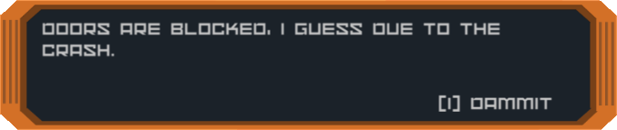
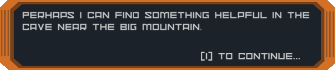
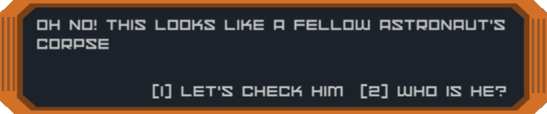
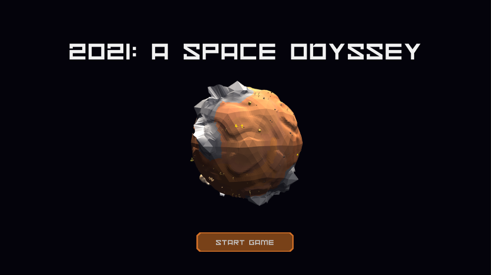
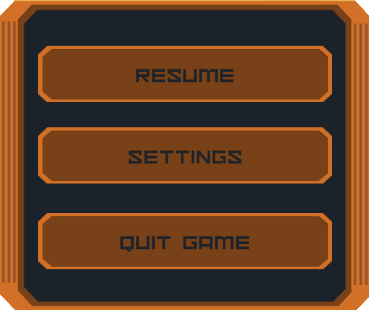
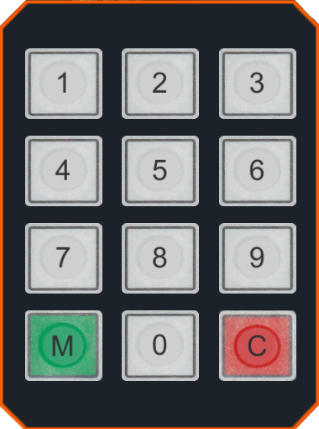

# Complex world

## Story

- linear 
- goal of the game is to escape back home
- only quest hints are given
    - correct path to points of interests is not show to the player

- The astronaut cannot get inside of his spaceship. He is hinted to explore his surrounding to look for something helpful. Eventually he enters a nearby cave where a previous astronaut died. After searching his body he is directed to an abandoned laboratory on the planet. There he looks for useful items that could help him get him home.

## Dialogs

-  addition of dialog manager
    - single choice

    

    

    - multiple choice

    

## UI

- addition of:
    - startup menu

    

    - in-game ESC menu

    

    - quest log
    
    

    - dialog text
    - intro scene
    - outro scene
    - quest specific UI
        - keypad

        

## Mechanics

- the only gimmic of the game is the fact that the world is spherical
    - point of interests can be accessed by several paths
- pickup item
- keypad
    - finding keypad password 
    - entering keypad password

## Characters

### Dead astronaut

- part of the questline
    - is key to the next quest point

