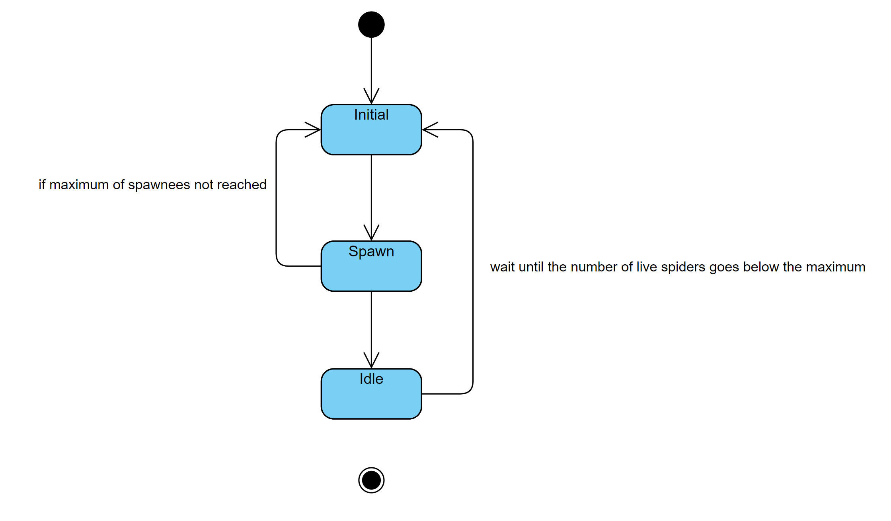

# Dynamický Svět

[zpět na celou dokumentaci](../README.md)

## Animations

Every dynamic object is in some way animated.

* Player - movement
* Spider - movement, attack, breeding, dying
* Aliens - movement
* Cacoons - alien strugling
* Eggs - hatching

## Cycle activities

1. Timed Spawner
  * Spawns preset dynamic object until it reaches maximum of live spawnees then it idles until the number of live spawnees decrease below the maximum.
  
    1.1 This type of spawner is used for spawning spiders
  
    1.2 Aliens spawn in slightly different way. Alien spawn in groups with preset number of aliens. Spawner spawns the whole group in a small interval then it idles. It idles until the whole group dies or returns to the spawner.
  
    

    

2. Spiders
    
  * Spiders spawn either a breeder or attacker. 
  
    2.1 Breeders randomly walk around the nest and if they reach a breeding spot they then tend to it. If the breeding spot is empty they then lay an egg in it.
  
    2.2 Attackers wonder around the nest and if an alien is in their attack. If they reach the attacked alien they encase (kill) the alien in a cacoon.

    

3. Breeding spot
  * Breeding spot is either empty or has an egg in it. If its occupied then the egg hatches in preset time. When the egg hatches it spawns a single spider.

    

4. Aliens
  * Aliens spawns and group of predetermined number. They wonder around their dwelling and if they are attacked they are encase in a cacoon and die in short time. After some time the group returns to their dwelling.

    

## Productions

* Spiders
  1. Spiders lay eggs then it hatches. The newly hatched spider is always born an attacker so it can the produce cacoon by catching aliens. (Spider -> Egg -> Spider)
  2. Spiders can catch up to an alien and encase it in a cacoon. (Spider -> Alien -> Cacoon)

* Aliens
  
  2. Mentioned above in spiders or in cycles. (Spider -> Alien -> Cacoon)

## Chování

* Spiders 
  * Attacker
    1. If an alien is in close proximity the spider chase it. If it reaches the alien then the spider encases it in a cacoon.
  * Breeder

    2. If it reaches an empty breeding spot then lays and egg in it else it tends to the egg.

* Aliens

  3. If they are attacked by spider then it runs back to their dwelling TO BE ADDED.

## Uniques

* Turtle 
    * If the player gets close enough, the turtle hides in its shell.
* Aliens
    * If preset number of aliens are encased in cacoons and are also close to each other. They all are set free.   
    
## Preview

* Spiders

    
    
* Aliens

    
