# Scenes
- Surface of the planet
- Abandoned laboratory
- Cave 
- Spaceship interirr
 
## Basic information
 - The game has low poly aesthethics 
 - Apart from the model of the planet that was made entirely in Blender and cave interior which was modelled using Unity Terrain editor and "low-polyfied" using terrain .obj exporter from this [YouTube video](https://www.youtube.com/watch?v=6WeS8dLgGIk)
 - Rest of the models are freely accessible from Unity Asset store:
   - [Astronaut](https://assetstore.unity.com/packages/3d/characters/humanoids/sci-fi/stylized-astronaut-114298)
    

   - [Spaceship](https://assetstore.unity.com/packages/3d/vehicles/space/space-shuttle-34972)
    

   - [Laboratory and Spaceship](https://assetstore.unity.com/packages/3d/environments/sci-fi/sci-fi-styled-modular-pack-82913)
    
   
   - [Desert rocks](https://assetstore.unity.com/packages/3d/environments/landscapes/polydesert-107196)
  

   - [Vegetation](https://assetstore.unity.com/packages/3d/vegetation/lowpoly-vegetation-season-pack-lite-96083)
  

   - [Rocks](https://assetstore.unity.com/packages/3d/environments/lowpoly-rocks-137970)
  

   - [Landscape models](https://assetstore.unity.com/packages/3d/environments/landscapes/lowpoly-environment-pack-99479)

   - [Spiders, Eggs, Cacoon](https://assetstore.unity.com/packages/3d/characters/creatures/fuga-spiders-with-destructible-eggs-and-mummy-151921)

   - [Alien model](https://assetstore.unity.com/packages/templates/packs/do-not-shoot-aliens-mobile-game-137557)
  

   - [Lava planets](https://assetstore.unity.com/packages/3d/environments/fantasy/free-low-poly-lava-plants-145043)

## Main scene
The main environment of the game is a planet. As planets are spherical in nature the main scene also respects it. The player has the freedom of moving to each site from any point. The planet has life-unfriendly environment there is little to almost none vegetation. The only inhabitants are life-threatening spiders and few humanoid inhabitants that barely go to the surface of the planet. Other scenes (such as cave, spaceship, laboratory) are accessible from the planet.

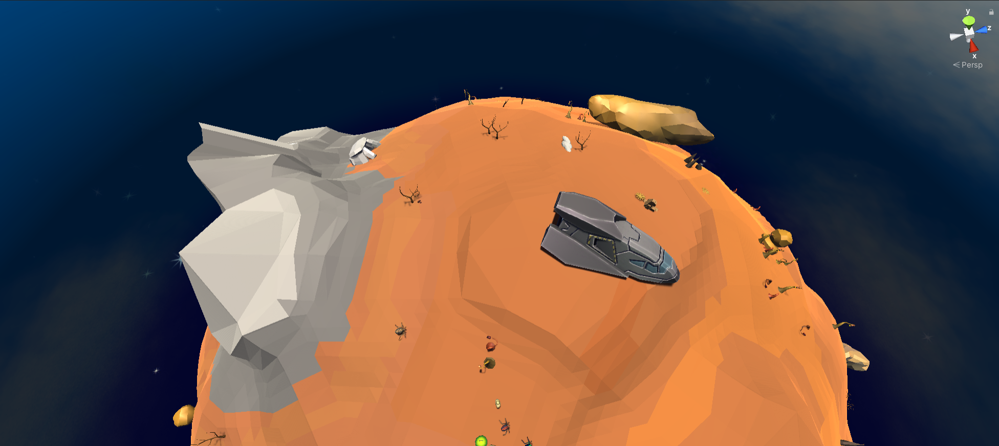

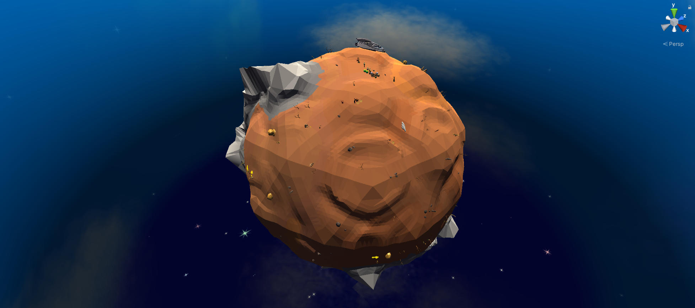

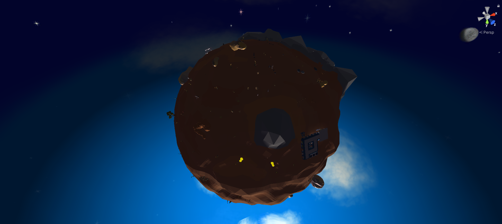

## Abandoned laboratory
The laboratory is accessible from the dark side of the planet. The laboratory was presumably abandoned in a hurry and interior of the lab only confirms it. The furniture and equipment is in disarray as if the place was ransacked.

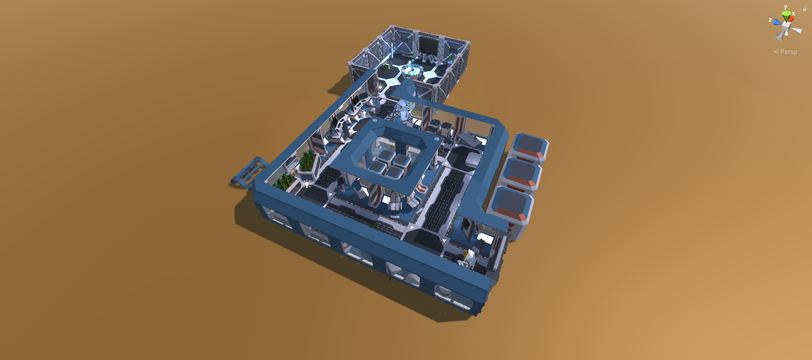

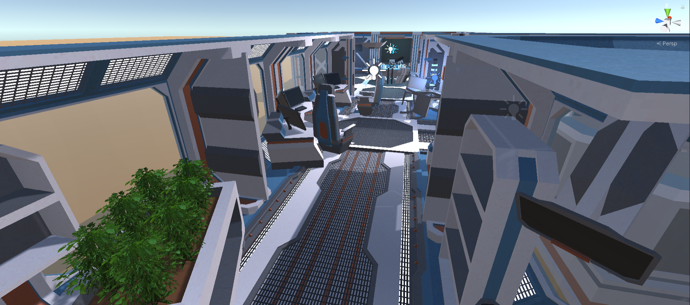

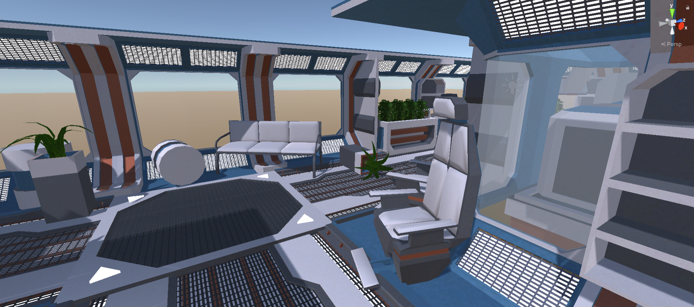

## Cave
Planet has a vast caves system. Few of them are inhabitated by humanoid creatures but are not accessible by the player. However, the player is able to access one of the caves. Cave entrances are visable on the planets surface.

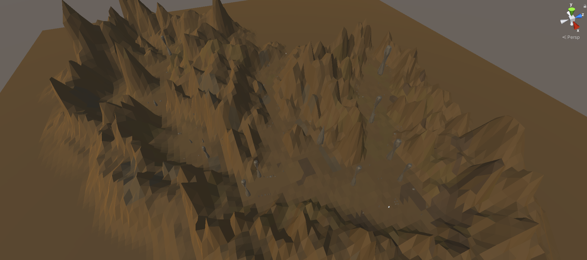

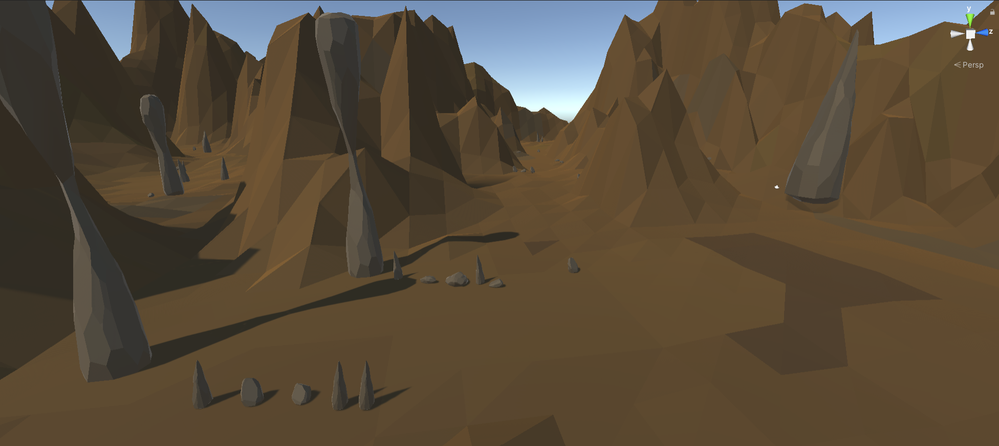

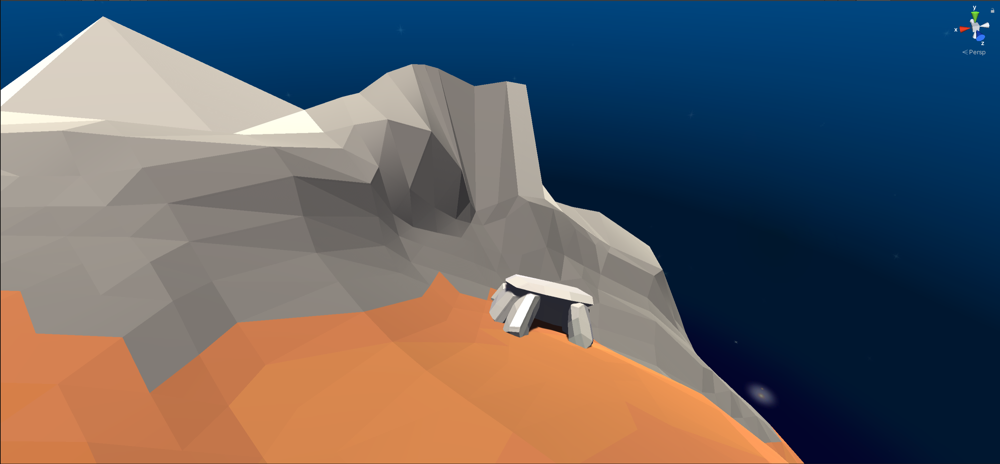

## Spaceship
This scene is the interior of the spaceship in which the main player landed on the planet. It contains advanced equipment that every spaceship has. 

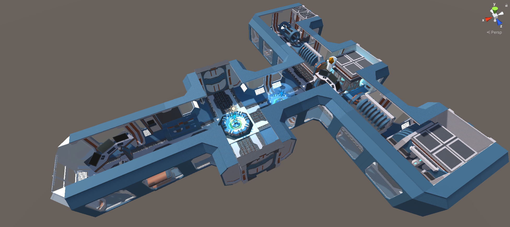

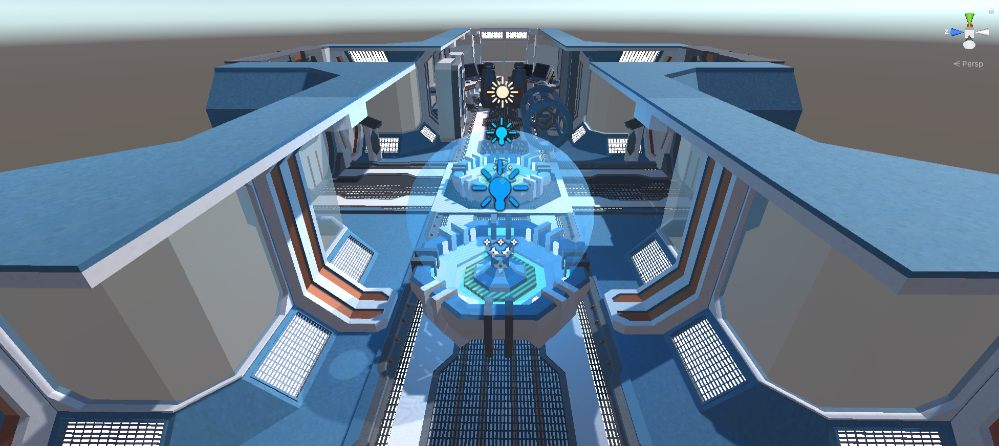

## Dynamic objects
For the dynamic objects several creature were selected from the Unity asset store:
  
  - Player - astronaut:
    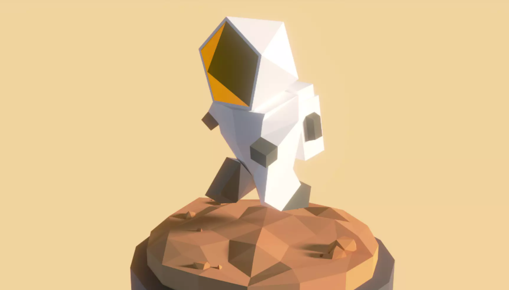

  - Spiders, Eggs, Cacoons:
    - Spiders have several unique colors
    - Eggs are animated
    - Cacoon created by spiders are animated
    
    

  - Aliens:
    - Colors of the aliens were edited.
    - Asset pack includes a standalone game
    - Only the assets were used
    
    

## Dwellings
  - Planet itself is a dwelling for the spiders. Either they spawn from timed spawner or hatch from eggs that spider lay on the ground
  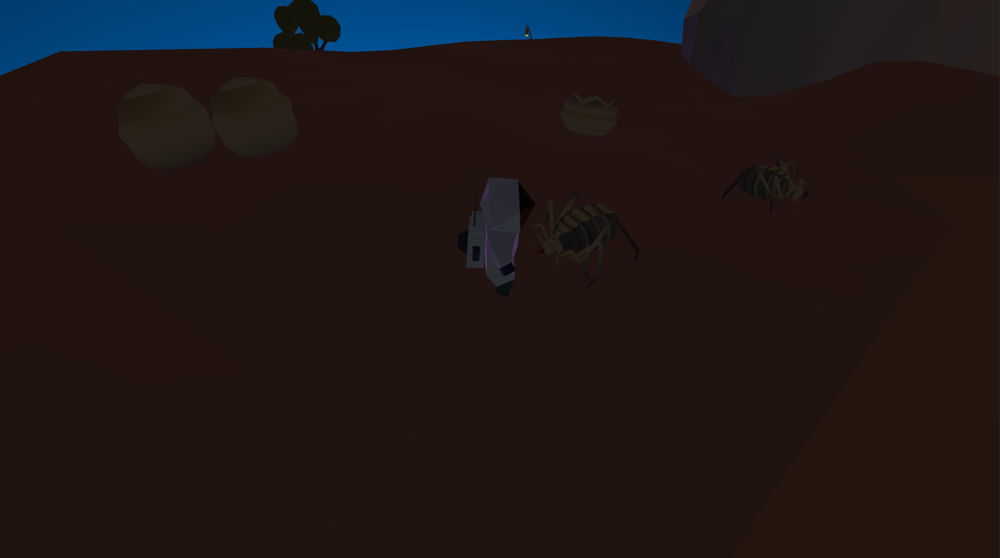

  - Cave (cave entrance) is dwelling for the humanoid creatures. In small numbers they walk around the front of the cave entrance.
  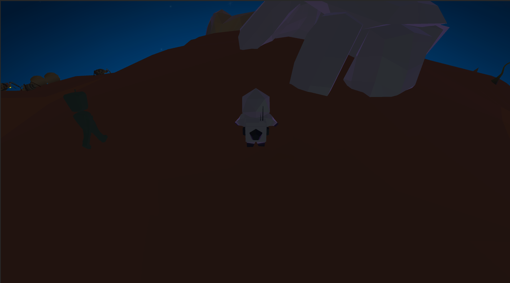
 